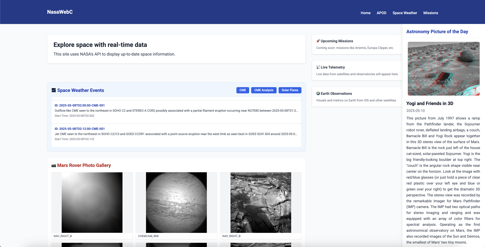

# NasaWebC 🚀

**NasaWebC** is a lightweight web project written entirely in **C**, designed to consume NASA's public APIs—especially the *Astronomy Picture of the Day (APOD)*. It serves as a practical example of how to build a functional API-driven web server in C using modern libraries.

---

## 🛠️ Tech Stack

- **C** (core backend logic)
- [`libcurl`](https://curl.se/libcurl/) for making HTTP requests to the NASA API
- [`cJSON`](https://github.com/DaveGamble/cJSON) for JSON parsing
- [`Mongoose`](https://github.com/cesanta/mongoose) for the embedded HTTP server
- **HTML + Tailwind CSS + Vanilla JS** for the frontend interface

---

## 📁 Project Structure

```
NasaWebC/
├── include/          # Header files (.h)
├── libs/             # External libraries: cJSON, mongoose
├── public/           # Frontend: HTML, CSS, JS
│   ├── css/
│   ├── js/
│   ├── components/   # Reusable layouts like header and footer
│   └── index.html
├── src/              # C source files (.c)
├── .env              # Environment variables (e.g., NASA API key)
├── Makefile
└── README.md
```

---

## ⚙️ Build & Run

Make sure you have `gcc`, `make`, and `cmake` installed. Then:

```bash
gmake
./nasa_server
```

The server will start on [http://localhost:8080](http://localhost:8080)

---

## 🔐 Environment Setup

You need a `.env` file in the root directory with your NASA API key:

```env
API_KEY=your_nasa_api_key_here
```

Get your key from: https://api.nasa.gov

---

## 🌐 Features

- Displays Astronomy Picture of the Day (APOD)
- Responsive UI with Tailwind CSS
- Sidebar with dynamic content from NASA
- Expandable image modal on click
- Component-based layout with header and footer injection

---

## 📸 Screenshot



---

## 📄 License

MIT License

---

## 🚧 Future Improvements

- Add support for other NASA endpoints (e.g., Mars Rover, EPIC)
- Improve error handling
- Integrate image caching and logging

---

> Built with 💻 in C as a low-level web architecture experiment.