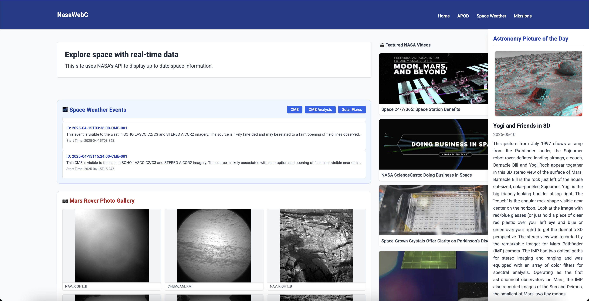
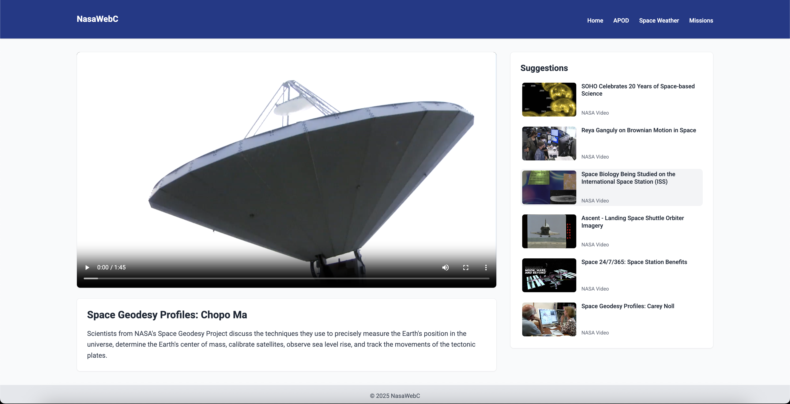

# NasaWebC 🚀

**NasaWebC** is a lightweight web project written entirely in **C**, designed to consume NASA's public APIs—especially *Astronomy Picture of the Day (APOD)* and *Mars Rover Photos*. It serves as a practical example of how to build an API-driven web server in C using modern libraries and a clean frontend interface.

## 🛠️ Tech Stack

- **C** (core backend logic)
- [`libcurl`](https://curl.se/libcurl/) for HTTP requests
- [`cJSON`](https://github.com/DaveGamble/cJSON) for JSON parsing
- [`Mongoose`](https://github.com/cesanta/mongoose) for the embedded HTTP server
- [`Stylus`](https://stylus-lang.com/) for CSS preprocessing
- **HTML + Vanilla JS** for the frontend
- **Daily local cache** mechanism to reduce API requests

## 📁 Project Structure

```txt
NasaWebC/
├── cache/                  # Local JSON cache files
├── include/                # Header files (.h)
├── libs/                   # External libraries (mongoose, cJSON)
├── public/                 # Static frontend files
│   ├── components/         # Header and footer HTML includes
│   ├── css/                # Compiled CSS (main.css, video.css)
│   ├── js/                 # Frontend scripts (main.js, ui.js, video.js)
│   ├── index.html          # Landing page
│   ├── video.html          # Video detail view
│   └── favicon.ico
├── resources/              # Stylus source files and screenshots
│   ├── styles/             # Stylus: main.styl, video.styl
│   ├── index.png           # Screenshot: home page
│   └── video.png           # Screenshot: video view
├── src/                    # C source files
│   ├── main.c              # Entry point
│   ├── server.c            # HTTP routing
│   ├── nasa_api.c          # NASA API calls
│   └── cache_utils.c       # Local cache helpers
├── .env                    # NASA API key
├── Makefile                # Build process
└── README.md
```

## ⚙️ Build & Run

Make sure you have `gcc`, `make`, and `stylus` installed. Then:

```bash
npm install -g stylus      # One-time install
make                       # Build and compile styles
./nasa_server              # Launches the local web server
```

Now open [http://localhost:8080](http://localhost:8080) in your browser.

## 🔐 Environment Setup

Create a `.env` file in the root with your NASA API key:

```env
API_KEY=your_nasa_api_key_here
```

You can get your API key at: [https://api.nasa.gov](https://api.nasa.gov)

## 🌐 Features

✅ Astronomy Picture of the Day (APOD) with image, title, and explanation  
✅ Sidebar component with dynamic APOD content  
✅ DONKI Space Weather Events:
   - CME
   - CME Analysis
   - Solar Flares  
   - Smooth carousel with auto-scroll  
✅ Mars Rover Photos:
   - Shows 30 unique photos from the last 30 days
   - Paged navigation (6 per page)
   - Filters duplicates and ensures recent variety  
✅ Fully responsive layout using utility classes  
✅ Stylus-powered styling (via Makefile)

## 🖼️ Screenshots

### Home Page


### Video Detail View


## 🧠 Upcoming Improvements

- Support additional endpoints (e.g., EPIC, NEO, Insight Weather)
- Server-side logging and diagnostics
- Filters and preferences panel (e.g., date range, rover, etc.)
- Zoom and camera filters for Mars Rover gallery
- Optional dark mode (alternate Stylus theme)

## 📄 License

This project is licensed under the MIT License.

Built with 💻 in C as a low-level web experiment, pushing the limits of raw APIs and embedded servers.